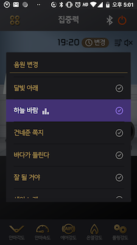
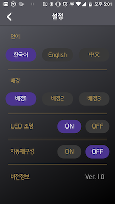
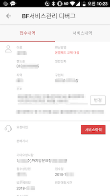
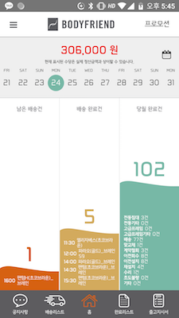
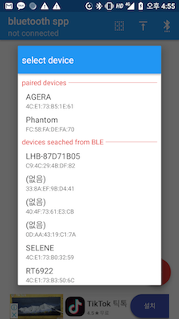

# 하이퍼커넥트(2019.04 ~ 현재)

VANA
-------------
[프로젝트 기간]
- 2019-04 ~ 2021-07

[프로젝트 내용] 
- WebRTC와 Video를 이용한 데이팅앱

[프로젝트 인원] 
- 안드로이드 2명

[개발 환경]
- Android studio, git, github, sourcetree, mac OS, kotlin, JIRA, Notion, Slack

[사용 기술]
- RxJava2
- mvrx
- Epoxy
- Koin
- Exoplayer
- Timber
- Joda -Time
- Fresco
- Facebook login
- Snapchat login
- Pubnub ("com.pubnub:pubnub-gson:4.21.0")
- Stetho ("com.facebook.stetho:stetho-okhttp3:1.5.1")
- transcoder ("net.ypresto.androidtranscoder:android-transcoder")
- image crop ("com.github.yalantis:ucrop")
- Easing anim library ("com.daimajia.easing:library:2.1@aar")
- Web RTC
- Billing v2
- Lottie
- Crashlytics
- rootingchecker ("com.scottyab:rootbeer-lib")
- Chuck
- CameraX

# 바디프랜드(2015.04 ~ 현재)

벤타스
-------------
[프로젝트 기간]
- 2018-10 ~ 2018-12

[프로젝트 내용] 
- 고객이 안마의자를 사용하는데에 필요한 무선리모컨 기능을 제공하는 앱
- SPP 통신으로 안마의자와 데이터 송/수신

[프로젝트 인원] 
- 안드로이드 1명

[개발 환경]
- Android studio, git, sourcetree, bitbucket, mac OS, kotlin, Java

[담당 업무]
- MVP 패턴을 적용
- constraint-layout을 사용한 UI 구성
- recyclerview사용
- glide 를 이용해서 gif 애니메이션 적용
- rxandroid2를 이용해서 데이터 처리
- BluetoothManager 사용

[프로젝트 성과]
- 플레이스토어 런칭예정

아제라
-------------
[프로젝트 기간]
- 2017-09 ~ 2017-11

[프로젝트 내용] 
- 고객이 안마의자를 사용하는데에 필요한 무선리모컨 기능을 제공하는 앱
- SPP 통신으로 안마의자와 데이터 송/수신
- HTTP 통신을 이용한 공기질 분석 데이터 표현(현재수치, 차트등)

[프로젝트 인원] 
- 안드로이드 1명

[개발 환경]
- Android studio, git, sourcetree, bitbucket, postman, mac OS, kotlin, Java

[담당 업무]
-  MVP 패턴을 적용
- 공기질 데이터 출력 MPAndroidChart를 사용하여 처리
- 주로 constraintlayout을 이용해서 레이아웃 구성 처리
- android의 bluetooth chat sample을 래핑하여 블루투스 상태에 대한 인터페이스를 구현하고, 안드로이드 6.0이상부터 필요한 블루투스 권한 처리에 대한 사항 구현, BLE 검색과 클래식 검색 기능 제공한 라이브러리를 gitpack에 등록하여 사용
- bluetooth spp 통신을 이용하여 수신된 데이터를 (대략 20바이트)를 비트단위로 잘라서 기능별로 behavior subject로 데이터 전달
- flavor를 이용한 프로젝트 분기처리(리모컨 전용, 공기질분석 추가)
- family font 적용(과거 typekit 사용)

[프로젝트 성과]
- 플레이스토어 런칭예정

사내예약
-------------
[프로젝트 기간]
- 2016-04 ~ 2016-05

[프로젝트 내용] 
- 사내에서 제공하는 복지시설 이용을 위한 앱
- 헤어, 네일샵, 의원, 반찬등 예약 기능
- 사내 식당 정보 제공
- 이용금액 조회
- 층별 공기질분석 조회

[프로젝트 인원] 
- 안드로이드 1명

[개발 환경]
- Android studio, git, sourcetree, bitbucket, mac OS, java, postman

[담당 업무]
- MVP 아키텍쳐 디자인 패턴 적용
- gson을 이용한 데이터 파싱
- auil을 이용한 이미지 처리
- 버터나이프 사용
- rxjava2 사용
- tedbottompociker 사용
- firebase crashlytics 사용
- volley를 이용한 html 통신
- photoview 를 이용한 상세화면 구성
- pageindicatorview 인디케이터 표기
- strokeTextView 사용
- DatePicker를 사용해서 예약 일자 지정
- retrofit를 이용한  http 통신

[프로젝트 성과]
- [플레이스토어 런칭](https://play.google.com/store/apps/details?id=bodyfriend.welfare)

AS서비스 앱
-------------
[프로젝트 기간]
- 2015.06 ~ 2015.07

[프로젝트 내용] 
- 당사의 AS기사분들이 이용하는 기사용 앱 개발
- 기존 수기로 문서를 작성하여 업무를 진행하던 방식을 개선하기 위한 앱 개발
- 서비스 리스트, 상세내역, 설치확인서, 사진첨부, 지도찾기, 약속 시간 문자, 공지사항, 서비스메뉴얼, 서비스 가격표, 업무일지, 보유 자재등 제공

[프로젝트 인원] 
- 안드로이드 1명

[개발 환경]
- Android studio, git, sourcetree, bitbucket, postman, mac OS, kotlin, Java

[담당 업무]
- MVP 패턴을 이용한 개발 진행
- Fragment와 ConstraintLayout을 이용한 화면 구성
- RecyclerView 사용한 리스트 구성
- 고객의 주소를 가지고 좌표변환해서 구글 맵에 마커를 찍어야하는데 Google Geocoder만으로는 변환이 되지 않는 주소들이있어서 Naver Geocoder와 동시에 주소변환하여 rxjava zip 함수로 합성
- AUIL을 이용한 이미지 로딩
- tedpermission 으로 권한 처리 
- 갤러리 이미지 로딩시 tedbottompicker 사용
- retrofit2 을 이용한 http 통신
- GCM 적용
- custom datepicker(커스텀 데이트 피커 다이얼로그)
- YouTubeAndroidPlayerApi 사용 하여 제품 설치 영상 조회

[프로젝트 성과]
- [플레이스토어 런칭](https://play.google.com/store/apps/details?id=com.bodyfriend.service.debug)
- 안정적인 앱 운영

배송앱
-------------
[프로젝트 기간]
- 2015.04 ~ 2015.05

[프로젝트 내용] 
- 당사의 배송기사들이 이용하는 기사용 앱 개발
- 기존 수기로 문서장석되어 업무진행하던 방식을 개선하기위한 자사의 배송앱 개발
- 배송리스트, 완료리스트, 상세내역, 설치확인서, 사진첨부, 지도찾기, 약속 시간 문자, 공지사항, 출고지시서, 스케쥴표(커스텀 달력) 등을 제공

[프로젝트 인원] 
- 안드로이드 1명

[개발 환경]
- Android studio, git, sourcetree, bitbucket, postman, mac OS, kotlin

[담당 업무]
- 배송리스트에 SwipeRefreshLayout 를 이용해서 갱신처리
- 리스트에서 retrofit2와 rx 를 이용해서 데이터 출력
- Fileprovider를 이용해서 카메라에서 이미지 가져오기 적용
- TedBottomPicker를 이용한 갤러리 이미지 가져오기 구현
- 고객서명을 이미지로 저장하는 커스텀뷰 개발하여 적용
- AUIL을 이용한 이미지 로딩
- 고객주소를 Google Geocode api와 Naver Geocode api 를 이용하여 위도, 경도로 변환하여 구글맵에 마커로 표기

[프로젝트 성과]
- [플레이스토어 런칭](https://play.google.com/store/apps/details?id=com.bodyfriend.shippingsystem)
- 안정적인 앱 운영

# SK증권(2012.04 ~ 2015.04)

주파수2
-------------
[프로젝트 기간]
- 2012.04 ~ 2015.04

[프로젝트 내용] 
- SK증권의 주식 앱인 주파수 운영 업무 진행

[프로젝트 인원] 
- 안드로이드 1명

[개발 환경]
  - 리눅스, 이클립스, SVN, 레드마인

[담당 업무]
- 신규로 반영되는 주식 정책에 대한 앱 반영
- 뷰페이저를 이용한 무한 페이지 전환되는 관심종목 페이지 개발
- 현재가 페이지에 뷰가 많아서 해당 화면 로딩시 오래걸리는 현상이 있어서 초기 앱 로딩시 스플래시 페이지에서 미리 로딩하여 속도개선
- CME 거래 기능 개발
- 자동 주문 기능 개발
- 메뉴 편집 기능 개발
    - 커스텀 뷰로 고객이 원하는 메뉴순서와 화면 구성 처리
    - Sqlite를 이용한 메뉴 순서 저장
    - 이동 및 드랍시 애니메이션 구현

[프로젝트 성과]
- [플레이스토어 런칭](https://play.google.com/store/apps/details?id=com.sks.android.neojoopasoo)
- 2012, 2013 올해의 금융앱 대상 수상

주파수1
-------------
[프로젝트 기간]
- 2012.04 ~ 2015.04

[프로젝트 내용] 
- SK증권의 주식 앱인 주파수1 운영 업무 진행

[프로젝트 인원] 
- 안드로이드 1명

[개발 환경]
  - 리눅스, 이클립스, SVN, 레드마인

[담당 업무]
- 신규로 반영되는 주식 정책에 대한 앱 반영

# 첼루호(2011.06 - 2012.01)

증강현실 모듈 개발
-------------
[프로젝트 기간]
- 2011.11 ~ 2011.12

[프로젝트 내용] 
- GPS와 자이로스코프 센서를 이용한 증강현실 모듈 개발

[프로젝트 인원] 
- 안드로이드 1명

[담당 업무]
- 카메라를 통해 들어오는 이미지를 배경으로 하고 GPS와 자이로스코프 센서를 이용하여 정해진 위치에 약국, 병원, 편의시설등에 대한 정보를 표기하는 앱 개발

KBS K 개발
-------------
[프로젝트 기간]
- 2011.07 ~ 2011.12

[프로젝트 내용] 
- KBS 사의 방송앱 K 1, 2차 개발 진행

[프로젝트 인원] 
- 안드로이드 1명

[담당 업무]
- 라이브 
    - 플레이어 화면 커스텀 UI 개발
    - http 통신으로 xml 을 파싱하여 리스트에 표기
- 다시보기
    - GridView를 이용한 내역 UI 구성
    - 한줄 댓글 기능 구현
- 편성표
    - 오늘 하루의 모든채널의 방송편성을 조회할 수 있는 편성표 개발
    - http 통신으로 파싱된 xml의 데이터를 기반으로 java code 단에서 linearlayout 과 textview 를 이용한 동적 생성
    - ScrollView를 이용한 스크롤
    - 플리킹시 GestureDetector로 이벤트를 받아와서 가우시안 정규분포를 이용하여 이동거리를 구한 후 Animation Interpolator를 이용한 패널이동 처리
- 마이리스트
- 설정
    - 푸쉬 메세지 수신인 C2DM 적용
- 로그인

[프로젝트 성과]
- [플레이스토어 런칭](https://play.google.com/store/apps/details?id=kr.co.kbs.kplayer)
- 10만 이용자 사용

# 이노필리아(2009.07 ~ 2011.01)

팬택 시리우스 런처앱 개발 
-------------
[프로젝트 기간]
- 2009.07 ~ 2010.06

[프로젝트 내용] 
- 휴대폰 제조사인 팬택사의 국내 첫 스마트폰 런처앱 개발 참여

[프로젝트 인원] 
5명

[담당 업무]
- 앱 아이콘 메뉴 개발
- 4x4의 셀로 구성된 배경에 아이콘 배치
    - 배치할 배경의 빈공간에 배치하는 로직 구현
    - 배치된 아이콘 롱클릭시 이동 기능 적용
    - 아이콘 삭제 기능 개발
- 하단의 앱 아이콘 메뉴트레이 개발
    - 좌우 스크롤, 플리킹시 반원의 궤적을따라 아이콘들이 이동되는 UI구현
    - 이동되는 아이콘의 위치에따라 스케일 처리
    - 롱클릭후 배경에 배치기능 구현
- 네온사인 위젯 개발
    - 저장한 문구가 마퀴되며 움직이는 기능 구현

[프로젝트 성과]
- 팬택 시리우스폰 출시

# 펫 프로젝트

블루투스 SPP 테스터
-------------
[프로젝트 기간]
- 2017-11 ~ 2017-12

[프로젝트 내용] 
- 회사의 spp통신을 이용한 프로젝트 진행중 송/수신 데이터의 확인을 위해 만든앱
- 송/수신하는 데이터를 hex 값으로 볼수있도록 적용
- 송신 데이터를 hex값을 입력받아 Realm DB를 이용하여 저장
- [개인 블로그에 해당 내용 포스팅](http://karrel.tistory.com/15)

[프로젝트 인원] 
- 안드로이드 1명

[개발 환경]
- Android studio, git, sourcetree, bitbucket, mac OS, java

[담당 업무]
- MVP 아키텍쳐 디자인 패턴 적용
- constraint-layaout을 이용한 레이아웃 구성
- recyclerview 로 아이템 출력
- tedpermission을 이용한 블루투스 권한 처리
- rx를 event bus로 이용
- 하단 배너 adview 적용

[프로젝트 성과]
- [플레이스토어 런칭](https://play.google.com/store/apps/details?id=com.karrel.bluetoothsample)

겟짤
-------------
[프로젝트 기간]
- 2018-08 ~ 2018-09

[프로젝트 내용]
- 카톡중에 어울리는 짤을 빠르게 전송하기위한 목적의 앱
- 상단에 검색바가 있고 검색어를 기입하여 기입하여 검색하면 관련된 google CSE에서 이미지 정보를 받아서 노출
- 상세보기, 다운받기, 카톡으로 전송하기 등의 기능 제공

[프로젝트 인원]
- 안드로이드 개발자 총 1명

[본인 역할]
- rx를 이용한 mvvm아키텍처 패턴 적용
- constraint-layaout을 이용한 레이아웃 구성
- gson 을 이용한 데이터 객체 생성
- recyclerview 로 아이템 출력
- glide 로 이미지 출력
- tedpermission을 이용한 권한 처리
- cardview 를 사용하여 아이템 뷰 구현
- 이미지를 클릭하면 PhotoView(open source)를 이용하여 상세 이미지 노출
- 처음에는 google image사이트에서 스크랩핑을 해서 이미지를 가져왓으나 후에 google CSE서비스를 이용
- okhttp3와 rx를 연동해서 데이터 처리
- Junit4를 이용한 테스트 코드 작성
- AdView 배너 적용

[프로젝트 성과]
- [플레이스토어 런칭](https://play.google.com/store/apps/details?id=karrel.com.getzzal)
- 한달 CSE비용 6달러 발생, 수입 0.3달러 발생

레이나
---
[프로젝트 기간]
- 2018-04 ~ 2018-05

[프로젝트 내용] 
- 카카오톡과  다이얼로그플로우를 이용한 개인 채팅봇 제작
- 오늘 날씨, 한강수온, 오늘 점심메뉴(사내식당)등에 대한 정보 제공

[프로젝트 인원] 
- 안드로이드 1명

[개발 환경]
- Android studio, git, sourcetree, bitbucket, mac OS, java, postman, dialogfrow, cafe24

[담당 업무]
- gson을 이용한 데이터파싱
- okhttp3 사용 
- ai.api 사용
- fcm 적용
