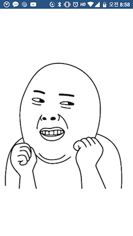

# PORTFOLIO

벤타스
-------------
[프로젝트 기간]
- 2018-10 ~ 2018-12

[프로젝트 내용] 
- 고객이 안마의자를 사용하는데에 필요한 무선리모컨 기능을 제공하는 앱
- SPP 통신으로 안마의자와 데이터 송/수신

[프로젝트 인원] 
- 안드로이드 1명

[개발 환경]
- Android studio, git, sourcetree, bitbucket, mac OS, kotlin, Java

[담당 업무]
- MVP 패턴을 적용
- constraint-layout을 사용한 UI 구성
- recyclerview사용
- glide 를 이용해서 gif 애니메이션 적용
- rxandroid2를 이용해서 데이터 처리
- BluetoothManager 사용

[프로젝트 성과]
- 플레이스토어 런칭예정

겟짤
-------------
[프로젝트 기간]
- 2018-08 ~ 2018-09

[프로젝트 내용]
- 카톡중에 어울리는 짤을 빠르게 전송하기위한 목적의 앱
- 상단에 검색바가 있고 검색어를 기입하여 기입하여 검색하면 관련된 google CSE에서 이미지 정보를 받아서 노출
- 상세보기, 다운받기, 카톡으로 전송하기 등의 기능 제공

[프로젝트 인원]
- 안드로이드 개발자 총 1명

[본인 역할]
- rx를 이용한 mvvm아키텍처 패턴 적용
- constraint-layaout을 이용한 레이아웃 구성
- gson 을 이용한 데이터 객체 생성
- recyclerview 로 아이템 출력
- glide 로 이미지 출력
- tedpermission을 이용한 권한 처리
- cardview 를 사용하여 아이템 뷰 구현
- 이미지를 클릭하면 PhotoView(open source)를 이용하여 상세 이미지 노출
- 처음에는 google image사이트에서 스크랩핑을 해서 이미지를 가져왓으나 후에 google CSE서비스를 이용
- okhttp3와 rx를 연동해서 데이터 처리
- Junit4를 이용한 테스트 코드 작성
- AdView 배너 적용

[프로젝트 성과]
- [플레이스토어 런칭](https://play.google.com/store/apps/details?id=karrel.com.getzzal)
- 한달 CSE비용 6달러 발생, 수입 0.3달러 발생

